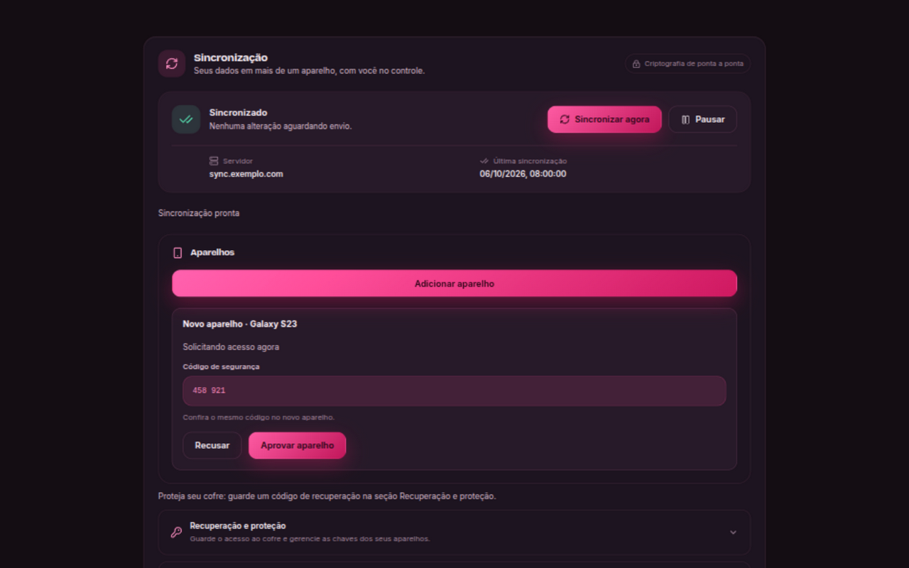
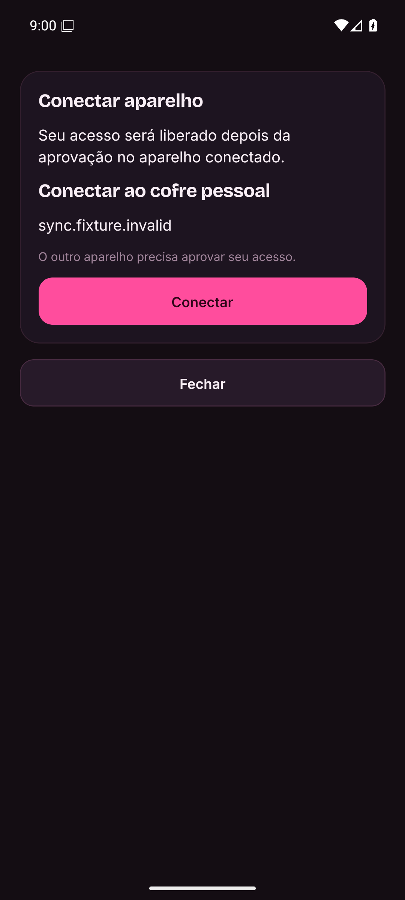

# Pareamento de aparelhos por convite LPV2

O fluxo normal tem quatro ações humanas, contando a leitura do QR:

1. No aparelho que criou o cofre, abrir **Adicionar aparelho**.
2. No novo aparelho, escanear o QR ou abrir o link.
3. No novo aparelho, conferir o cofre/domínio e tocar **Conectar**.
4. No aparelho autorizado, conferir o código curto e tocar **Aprovar aparelho**.

O restante é automático: discovery, validação do servidor, preparação de identidade, pedido, consulta de aprovação, registry, grant, delivery selada, checkpoints, backup local, vinculação e primeiro sync. Não há login no aparelho novo, campos de fingerprint ou botões para conferir convite, buscar pedidos, entregar/receber chave. As decisões que permanecem são escolher o cofre e autorizar acesso. Comparar o código não exige digitá-lo nem abrir outra tela.

## Antes e depois

A sequência relatada no pedido tem 13 interações no aplicativo: nove no aparelho novo e quatro no autorizado, incluindo preencher servidor/convite/códigos e os botões intermediários. Logins OIDC, troca de aparelho e navegação adicional ficam fora dessa contagem; portanto ela é conservadora. O fluxo LPV2 tem quatro ações no total, incluindo escanear: duas no aparelho novo e duas no autorizado. O E2E aciona as telas reais e exige exatamente essa sequência.

A primeira configuração também foi reduzida: **Configurar sincronização → URL HTTPS → Conectar → login OIDC → sincronização pronta**. Conectar inclui criar o cofre e fazer backup/vincular; discovery e preparação de chaves não são decisões humanas separadas.

## Convite temporário, finalidade limitada

Escolhemos a opção A: cada **Adicionar aparelho** emite um convite aleatório válido por 15 minutos, vinculado a um único pedido/dispositivo. Gerar outro cancela convites anteriores ainda não utilizados, sem afetar aparelhos conectados. **Cancelar convite** revoga explicitamente o convite exibido. A validade limita exposição de QR fotografado/encaminhado e spam futuro; não acrescenta passos ao caso normal. Um QR permanente espalharia um segredo duradouro sem benefício para a sequência de quatro ações.

O texto compartilhável é `lionpocket://pair/LPV2.<base64url-canônico>`. O envelope contém versão, finalidade `device-pairing`, UUID do convite, endpoint HTTPS, TrustPin completo, expiração, hash da capability, chave pública de verificação da capability e assinatura da autoridade. O QR/link também contém uma seed aleatória de 256 bits. Ela é a capability, não uma chave financeira nem uma credencial de conta.

A autoridade assina todos os campos públicos, incluindo endpoint/TrustPin/verificador. O aparelho novo valida assinatura, hash da seed e correspondência da chave pública derivada antes de usar o endpoint. Depois faz discovery e verifica `controlVersion=2`, `protocolVersion=1`, `domainSchema=1`, suite, escopo financeiro, `pairingVersion=2`, identidade e epoch do servidor. URLs não canônicas, HTTP em produção, convite alterado, versão incompatível e troca de servidor/epoch são recusados.

## Autenticação sem entregar a capability ao servidor

A seed gera um par Ed25519. O novo aparelho assina, com ela, um transcript canônico com separação de domínio que inclui o envelope do convite, pedido assinado e nome do aparelho. O pedido também é assinado pela identidade própria do aparelho e inclui as duas chaves públicas e nonce. O servidor guarda apenas envelope público, hash/verificador, expiração, revogação e vínculo do único dispositivo. A seed nunca é enviada à API.

O aparelho autorizado verifica novamente a assinatura da autoridade e a assinatura da capability sobre o pedido/nome antes de emitir o grant. Assim, um servidor malicioso não pode substituir chaves ou renomear o pedido apenas por conhecer o banco de convites. A UI LPV2 não aceita downgrade silencioso para um pedido sem autenticação da capability.

O código de segurança de seis dígitos é derivado do identificador do convite e do fingerprint criptográfico do pedido, que inclui ambas as chaves do aparelho, nonce e escopo. Os dois aparelhos mostram o mesmo código. Essa comparação visual continua útil para selecionar o aparelho correto quando alguém obteve uma cópia do convite; não há campo para redigitá-lo. O nome é informativo, sanitizado e autenticado no transcript, mas não prova a identidade física de quem está usando o celular.

## Contratos separados de conta, convite e aparelho autorizado

| Contrato | Autorização | Poderes |
| --- | --- | --- |
| `POST /v2/pair/:invite/request` | Capability assinando pedido + prova da chave do novo aparelho | Somente criar o pedido daquele cofre |
| `POST /v2/pair/:invite/status` | Prova assinada do único aparelho vinculado ao convite | Estado; após aprovação, registry/checkpoints públicos e apenas a própria delivery selada |
| `POST /v2/devices/vaults/:vault/:action` | Grant ativo assinado + prova HTTP da chave do aparelho | Operações do aparelho; mutações de autoridade ainda exigem assinatura da autoridade |
| `/v1/...` | OIDC e as verificações/provas existentes | Criação da conta/cofre, recuperação e contratos antigos |

As novas rotas de convite não tornam `/v1` pública. Possuir endpoint, TrustPin, convite ou assinatura da capability não permite ler commits/dados, emitir grants, aprovar/revogar aparelhos, criar checkpoints ou buscar delivery de outro dispositivo. Antes de existir grant ativo **e** delivery, status retorna somente `waiting`; recusa mantém o aparelho sem chave. Conta desabilitada continua bloqueada em todos os transportes.

O novo transporte de dispositivos permite sync após a aprovação sem compartilhar sessão OIDC. Perfis já conectados podem migrar automaticamente ao transporte por grant/prova, validando o registry local assinado, quando o servidor anuncia LPV2. Criação inicial e recuperação continuam usando OIDC. Futuro compartilhamento entre contas deverá ter um contrato separado: o convite LPV2 não altera membros/contas de um cofre.

Proof HTTP assina método, caminho real, origem, corpo, escopo e nonce. O ledger de nonces rejeita replay, inclusive após operações rejeitadas cuja prova válida foi consumida. Uma nova prova para o mesmo pedido imutável pode receber resposta idempotente: necessário quando a resposta anterior se perdeu. Outro dispositivo não pode reutilizar o convite consumido. O limite é de dez pedidos ativos por cofre e 90 chamadas/minuto por IP nas rotas de onboarding, incluindo polling; não confiamos em `X-Forwarded-For`. Atrás de um proxy que concentra IPs, várias sessões simultâneas podem compartilhar esse limite.

## Aprovação, continuidade e recuperação

**Aprovar aparelho** executa grant, delivery selada para a chave pública do destinatário e rotação/checkpoint no modelo atual. A intenção de aprovação é persistida antes da primeira mutação; se a rede cair ou o app reiniciar, o owner conclui a mesma operação automaticamente. Uma falha após concluir a rotação, antes de limpar a intenção, pode causar uma rotação adicional segura; nunca autoriza um dispositivo diferente.

Polling foreground de três segundos é single-flight. Pedidos aparecem sem refresh; o novo aparelho recebe aprovação, valida grant/registry/checkpoints, abre a delivery localmente, faz backup, vincula e inicia sync. Identidade e pedido são persistidos antes da requisição; a capability fica no SecretStore protegido somente até o ACK durável. Restart e perda de ACK retomam com nova prova e a mesma identidade. O aplicativo retoma o modal de espera no Android. Após expiração/recusa/cancelamento, um convite novo pode reutilizar a identidade do pedido ainda não aprovado.

Primeira criação pode ativar sync antes de salvar recovery: não existe dependência criptográfica entre confirmação humana do código e sigilo/grant/baseline. A UI mostra **Proteja seu cofre** persistentemente até guardar/confirmar a recuperação. Perder todos os aparelhos antes disso continua significando perder acesso; a ação de guardar recovery permanece disponível. A confirmação do código e os contratos de recovery/restauração, incluindo Recovery B, escrow, staging e ativação de epoch, continuam protegidos. Um consumidor que exige a política anterior pode manter `requireRecoveryConfirmation=true`.

Na recuperação LPV1, o convite deve vir da cópia guardada junto do código, como orienta a tela. Redigitar o fingerprint calculado dessa mesma cópia não autenticava uma fonte adicional. A segurança continua em `openRecovery`: assinatura do envelope, AEAD com chave derivada do código secreto, associated data de escopo/versão, autoridade pública do bundle igual ao TrustPin e chave pública derivada da seed igual à autoridade. Um servidor que substitua o convite/autoridade não consegue produzir um bundle que abra com o código original. Essas verificações e a confirmação de guardar o código não foram removidas.

E2EE, grant chain, deliveries seladas, checkpoints antirollback, rotação, revogação, isolamento de vault e backups continuam no motor existente. O QR é gerado localmente; a imagem Android é um PNG em memória, sem serviço remoto ou arquivo temporário. Não registramos convite/seed/chaves em logs da aplicação. Compartilhar/copiar deliberadamente o link dá acesso à capability de solicitar entrada, mas nunca às chaves sem aprovação.

## LPV1 e atualização self-hosted

LPV1 permanece metadata pública para recuperação e contratos antigos. Não recebe novos poderes. Colar LPV1 no novo pareamento mostra explicitamente que é preciso gerar outro convite em **Adicionar aparelho**. O novo painel mostra/aprova pedidos autenticados LPV2; clientes antigos ainda podem usar seu fluxo `/v1` com OIDC e verificação explícita original. A API legada `approve(deviceId, fingerprint)` continua disponível para esses consumidores. Não convertê-los silenciosamente evita downgrade de autenticação.

Servidor e aplicativos precisam da versão com `pairingVersion=2` para o fluxo novo. `controlVersion`, protocolo financeiro e schema de domínio não mudam. A migração PostgreSQL é aditiva/idempotente: tabela `sync_pairing_invites` e campos de convite/nome/autenticação/recusa em `sync_pairings`. Não há nova configuração OIDC, conta compartilhada, porta, serviço ou segredo no `.env`. Atualize a imagem com `./lpctl up`, preservando identidade/epoch, volumes e backups. Clientes antigos seguem nas rotas antigas; servidor antigo recebe mensagem de atualização no pareamento LPV2. Android precisa ser recompilado para registrar o deep link e o módulo de QR.

O leitor integrado usa [Google Code Scanner](https://developers.google.com/ml-kit/vision/barcode-scanning/code-scanner), processa no aparelho e depende do módulo Play Services. Sem esse módulo, pode-se usar a câmera externa que abre o link ou colar o convite. Desktop exibe QR, copia link e usa compartilhamento quando o ambiente oferece essa API; câmera desktop fica fora deste PR.

## Evidências e limites dos testes

`apps/sync-server/src/pairing.integration.test.ts` usa PostgreSQL e Keycloak reais, SQLite/adapters Desktop e Android e controladores completos. O E2E de quatro ações monta os componentes reais Desktop/Mobile; somente primitivas nativas, leitor e transporte IPC são adaptados ao runner. O deep link equivalente à leitura da câmera é injetado como permitido para CI.

| Requisitos do pedido | Evidência |
| --- | --- |
| 1–4: entrada direta, endpoint, discovery, sem OIDC novo | E2E de telas + smoke em APK instalado + três direções de adapters |
| 5–13: sem chave antes de aprovação, pedido automático, uma aprovação, sem digitação, grant/delivery/checkpoints/primeiro sync | E2E de telas e testes de cofre com lançamento financeiro cifrado replicado |
| 14–20: alteração/capability/expiração/revogação/replay/pin-only/atacante/recusa | Testes negativos via contratos HTTP reais e ausência de chave no SecretStore |
| 21–23: restart/rede/LPV1 | Perda de ACK, restart de ambos os controladores, aprovação interrompida e rejeição explícita LPV1 |
| 24–26: Desktop ↔ Android, Android ↔ Android | Três combinações de adapters/SQLite reais; Android como fundador nos casos em que autoriza |
| 27: rotação/revogação | Teste LPV2 e suítes existentes de checkpoint/recovery/epoch |
| 28: segredos | Ausência de seed no banco/profile público; smoke verifica logs da aplicação Android; nenhum convite é impresso pelo harness |
| Servidor malicioso/downgrade | Autenticação de capability alterada/removida não produz delivery |
| Upgrade do owner | Perfil sem novo transporte passa a grant/prova sem outro login |

`tools/pairing/android-deeplink-smoke.cjs` abre um LPV2 sintético no APK normal instalado, usando usuário Android temporário em emulador descartável, e verifica um único **Conectar**, domínio obtido do convite e ausência de segredo nos logs da aplicação. O workflow Android executa o teste depois de preservar/verificar fixtures de atualização. Não simula câmera física nem afirma um teste de pareamento completo entre aparelhos físicos.

Verificação visual: painel Desktop no preview e modal no Android instalado. Capturas usam somente dados sintéticos; a imagem de aprovação não contém capability.

Validação executada nesta mudança:

- `npm test`: 543 testes passaram; suítes de integração ficam opt-in nesse comando.
- `npm run sync:dev:test`: 80 testes passaram, incluindo dez novos casos LPV2; um teste de skew precisa do artefato antigo que o workflow prepara e ficou skipped localmente.
- `npm run typecheck`, lint sem erros e `git diff --check`.
- `npm run sync:self-hosted:validate`, 25 testes de operação e smoke completo com TLS, contas, LPV2, privacidade, offline e restauração E1 → E2 → E3.
- Android debug e release com assinatura explícita de desenvolvimento; deep link no APK normal instalado em emulador Android 36. Câmera física e pareamento entre aparelhos físicos não foram executados localmente.

O modelo de autoridade existente foi preservado: **Adicionar aparelho/Aprovar** ficam disponíveis no fundador/owner que possui a seed da autoridade, incluindo Android quando ele criou o cofre. Um aparelho secundário com grant de sync não recebe essa seed ou novos poderes de autoridade implicitamente.
