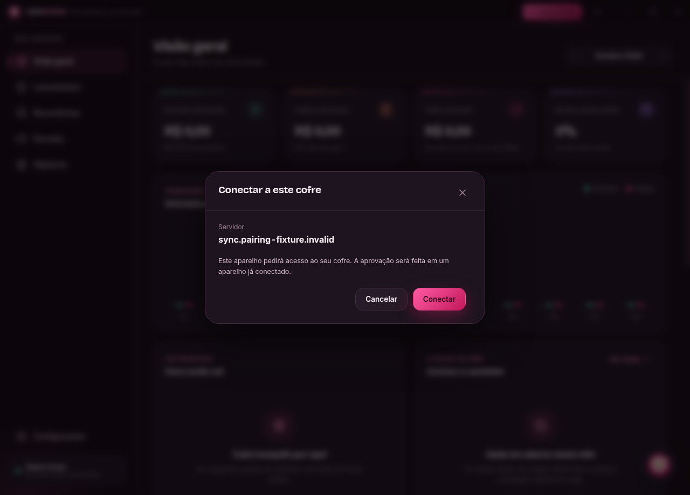

# Pareamento de aparelhos por LPV2

LPV2 é o único contrato de convite. O mesmo `lionpocket://pair/LPV2.<payload>` serve para Android, Desktop, QR, compartilhamento e clipboard. O aparelho novo não faz login OIDC nem digita fingerprint ou código de segurança.

## Caminhos recomendados

**Desktop → Mobile:** Adicionar aparelho → mostrar QR Code → celular escaneia → Conectar → aprovar no Desktop.

**Mobile → Desktop:** Adicionar aparelho → Compartilhar convite ou Copiar link → abrir o link no computador → Conectar → aprovar no celular.

A apresentação oferece QR, Compartilhar convite e Copiar link, sem perguntar antecipadamente qual será o destino: **“Escaneie com outro celular ou abra o link no computador.”** O convite vale por 15 minutos e um aparelho. **Copiar convite / Colar convite** é o fallback universal.

Após a aprovação, polling, grant, delivery selada, checkpoints, backup local, vinculação e primeiro sync são automáticos. Os dois aparelhos exibem o mesmo código curto para comparação visual, sem digitação.

## Deep link no Desktop instalado

Abrir um convite válido mostra diretamente **Conectar a este cofre**, domínio do servidor, explicação da aprovação e **Cancelar / Conectar**. Somente Conectar cria o pedido. Abrir ou cancelar o link não entrega chave, aprova aparelho ou concede acesso.

O processo principal recebe `argv` na abertura fria, encaminha `second-instance` à instância com `requestSingleInstanceLock`, restaura/foca a janela e trata `open-url` em macOS. A segunda instância termina antes de abrir banco ou janela. A caixa de entrada mantém o convite em memória até o renderer confirmar o recebimento, inclusive durante React StrictMode. Reabrir o mesmo link preserva identidade e pedido, sem duplicação.

- Linux/Zorin/Ubuntu: o `.deb` instala `MimeType=x-scheme-handler/lionpocket;`, `Exec=lionpocket %u` e atualização do desktop database. O pacote depende de `desktop-file-utils`.
- Windows: o executável instalado registra o protocolo durante Squirrel install/update e inicialização normal. Uninstall remove a associação. O comando aponta para o aplicativo instalado.
- Normal e beta usam o mesmo scheme; o SO seleciona a associação. Desenvolvimento não substitui o aplicativo instalado.

O Desktop não exige câmera, leitor de QR, navegação por Configurações ou colagem manual. Android usa [Google Code Scanner](https://developers.google.com/ml-kit/vision/barcode-scanning/code-scanner); sem o módulo Play Services, o link e o clipboard continuam disponíveis.

## Convite e autenticação

O envelope canônico contém versão 2, purpose `device-pairing`, UUID, endpoint HTTPS, TrustPin completo, expiração, hash/verificador da capability e assinatura da autoridade. QR/link incluem uma seed aleatória de 256 bits, que permite somente solicitar entrada. Ela não é chave financeira nem sessão de conta.

O novo aparelho verifica assinatura, formato, finalidade, versão, endpoint, expiração, hash da seed e chave pública derivada. Discovery valida servidor/epoch, versões e capacidades. O aparelho cria suas próprias chaves e assina o pedido. A capability assina um transcript que inclui convite, pedido e nome do aparelho. O servidor não recebe a seed.

A autoridade verifica novamente esse transcript antes de `approve(deviceId)`. Todos os pedidos persistidos têm convite, nome e autenticação obrigatórios. Grant assinado, delivery selada e aprovação humana permanecem necessários. Convites cancelados, expirados, consumidos, adulterados ou destinados a outro servidor são rejeitados.

O SAS de seis dígitos vincula convite e fingerprint criptográfico do pedido, incluindo chaves, nonce e escopo. O nome autenticado ajuda a identificar o pedido, mas não prova a identidade física do usuário.

## Contratos atuais

| Contrato | Autorização | Poderes |
| --- | --- | --- |
| `POST /v2/pair/:invite/request` | Capability e prova do aparelho | Criar um único pedido |
| `POST /v2/pair/:invite/status` | Prova do aparelho vinculado | Espera; após aprovação, registry/checkpoints e própria delivery |
| `POST /v2/devices/vaults/:vault/:action` | Grant ativo e prova assinada | Transporte e operações de dispositivos; mutações de autoridade exigem sua assinatura |
| `POST /v1/vaults` | OIDC, request e grant fundador assinados | Criar cofre |
| `/v1/vaults/:vault/recovery-*`, `recover`, `epoch-*` | OIDC e verificações criptográficas específicas | Recuperação durável, epoch/staging/activation |

Dispositivos aprovados usam exclusivamente signed-device transport. A prova HTTP cobre método, caminho real, origem, corpo, escopo e nonce, com digest vazio de token de conta. O ledger rejeita replay; uma prova nova para o mesmo pedido imutável permite retomar uma resposta perdida. Conta desabilitada e grant revogado bloqueiam acesso.

Gerar outro convite cancela os ainda não utilizados. Cancelar convite revoga explicitamente o convite exibido. O limite é dez pedidos ativos por cofre e 90 chamadas/minuto por IP nas rotas de onboarding. Seed, URI completo, chaves e código de recovery não aparecem nos logs.

## Recovery e instalação

Recovery usa um [pacote próprio LPR1 e código secreto](recovery.md), sem capability temporária. Criação e recovery mantêm OIDC; pareamento e sync de aparelhos aprovados não exigem sessão de conta.

A instalação self-hosted cria diretamente o schema atual. Servidores e clientes incompatíveis não são suportados. A instalação anterior deve ser recriada, após preservar o banco financeiro local escolhido; siga o [procedimento de reset e rebaseline](self-hosting.md#servidor-recriado-e-base-local-como-fonte-de-verdade).

## Testes

`pairing.integration.test.ts` exercita PostgreSQL/Keycloak reais, os dois adapters SQLite, três direções de pareamento e as telas reais Desktop/Mobile. Cobre QR, deep link, fallback, aprovação, chave/primeiro sync, expiração, revogação, replay, adulteração, ausência de OIDC no novo aparelho, restart, perda de rede, rotação, recovery e reset com backup.

`pairingLinks.test.ts` verifica eventos Electron, cold/warm start, single instance, validação e retomada do renderer. `protocol-registration.test.cjs` constrói/inspeciona DEBs normal/beta. Os smokes em `tools/pairing` verificam aplicativos instalados no Windows/Linux e o deep link no APK Android. A [validação local](local-validation.md) injeta o convite no handler do SO, sem depender de câmera física; Windows exige host descartável próprio.

`current-onboarding.test.cjs` impede reintrodução do marcador do formato de convite substituído no conteúdo do repositório.

